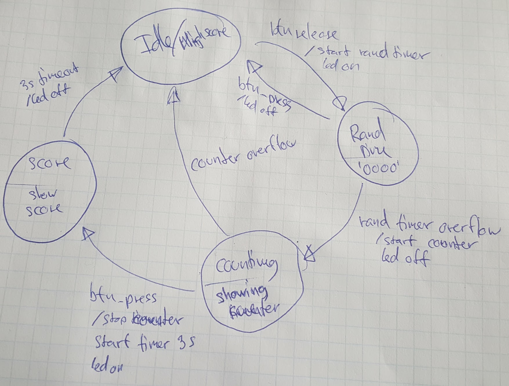

# Time Reaction Tester
A time reaction tester in VHDL for the [Digilent BASYS FPGA board](http://store.digilentinc.com/basys-fpga-board-retired/).

#### Problem:
The program should use one button, one led and four 7seg displays.  
When the button is released, the LED should turn on. After a random period of time, the LED should turn off and a timer should be started. When the button is pressed, the timer should stop. A high score should be kept.

#### Solution:
The following state machine shows the general behaviour of the program.

The program starts in Idle. When in idle, the high score is shown. The highscore has an initial value of 9999.

The button module is an extended version of Jørgen Jeppes button module.
The previous 'pulse' is renamed to 'press', and an output 'release' is added.

A counter module is implemented with a generic size property.
It is possible to reset the counter with a specific reset value and outputs the value and an overflow bit.

The random delay time has a min and max value.
A counter A with the size of max-min is used with the 50 MHz clock to generate the random part of the delay. The value of A is used to set the value of another counter, B, with the size of max.
The value of B is set when going from the idle state to the random delay state.

A 7seg module is implemented to convert from binary numbers to the corresponding representation on a 7seg display.

A 7seg multiplexer is implemented to utilize all 4 displays with only 1 set of cathode pins.
The frequency for the multiplexer is chosen to be 100Hz to make sure, it is not visible.
